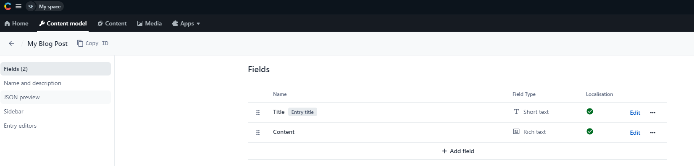
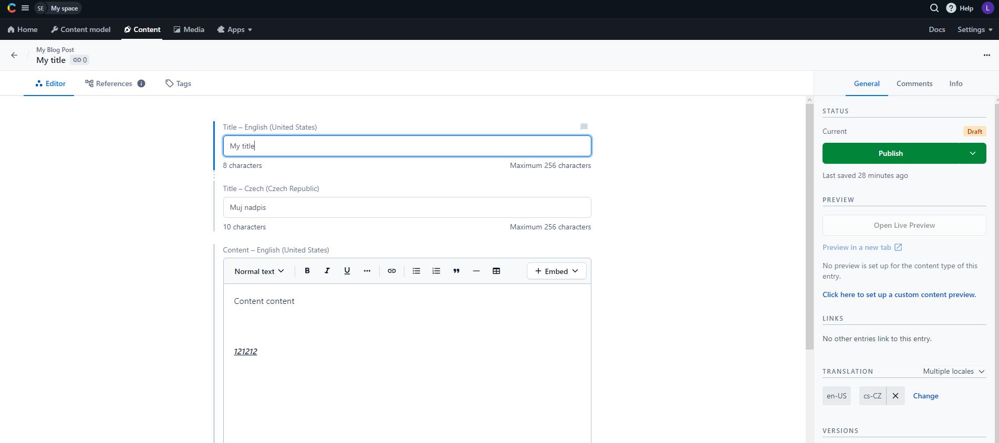
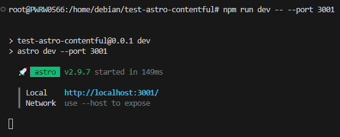
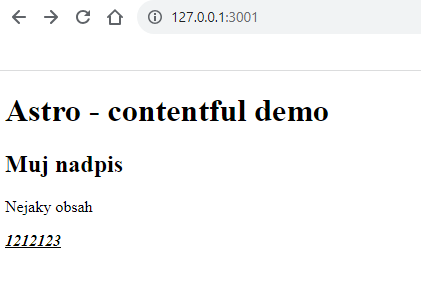

## Info

* SSG - https://astro.build/  
* SSG tutorial - https://docs.astro.build/en/guides/cms/contentful/  
* CMS - https://www.contentful.com/

## Code

Vsechno dulezity se nacita v kodu [tady](src/pages/index.astro)
1. v CMS se nadefinuje content model - struktura dat, ktery chci zobrazovat
2. v CMS se nadefinuje content - napisu vlastni obsah
3. SSG vygenerovani stranky - skript mezi `---` se spousti pri generovani staticky stranky
    * z CMS se stahnout data
    * data se poslou do sablony, kde se zobrazi jako list

## Content model

## Content

## Run demo

## Browser demo

